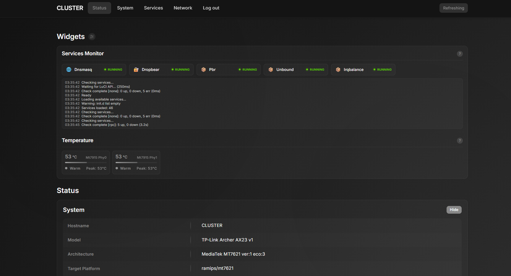
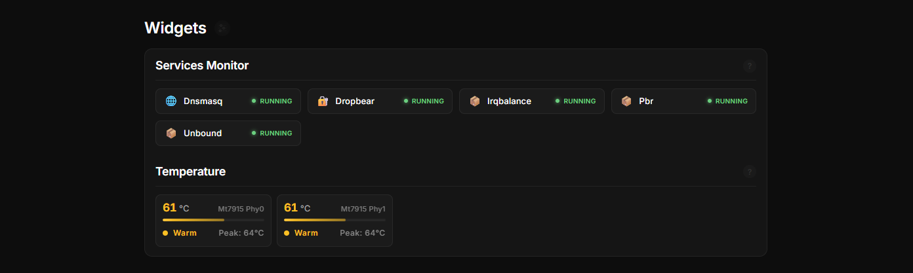
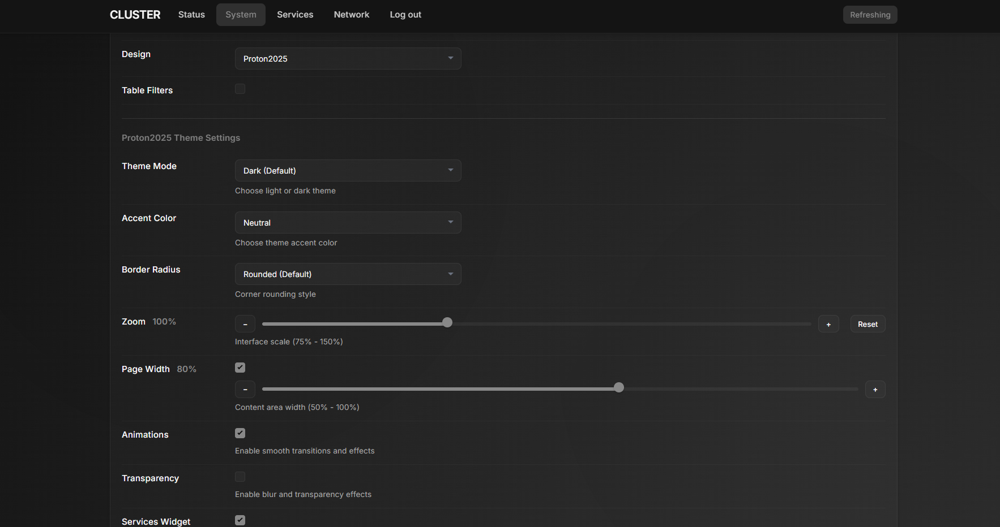

# luci-theme-cluster

An elegant LuCI theme (OpenWrt 23.x+) with a dark design and optional light mode.


## Screenshots

### LuCI Status

<div align="center">
  
</div>

### Services monitoring widget

<div align="center">
  
</div>

### Theme Settings

<div align="center">
  
</div>

## Features

- 🌙 Dark glass/blur design with optional light mode
- 🎨 Customizable accent color, border radius, zoom
- 📱 Responsive layout for mobile devices
- ⚡ Compatible with LuCI ucode (OpenWrt 23.x+)
- 📊 Services monitoring widget on Status → Overview page
- 🌡️ Temperature monitoring widget with thermal sensors
- 📈 Elegant Load Average visualization with color-coded progress bars
- 🔌 Automatic styling for third-party packages and custom pages
- 🌐 Multi-language support (10 languages: EN, RU, ZH, DE, UK, ES, PT, PL, FR, IT)
- 🔄 Settings sync across browsers/devices (localStorage + UCI)

## Widgets

### Services Widget

The main page (Status → Overview) displays a widget showing system service statuses:

- Status visualization (Running/Stopped)
- Add services via model or custom input
- Settings saved in browser

### Temperature Widget

Real-time temperature monitoring on Status → Overview:

- Reads data from `/sys/class/thermal/` and `/sys/class/hwmon/`
- Color-coded levels (Normal, Warm, Hot, Critical)
- Peak temperature tracking
- Auto-refresh every 5 seconds
- Built-in ucode RPC module (no external dependencies)

## Theme Settings

Available at **System → System → Language and Style**:

- Theme mode (Dark/Light)
- Accent color (Blue, Purple, Green, Orange, Red)
- Border radius
- Interface zoom
- Animations and transparency
- Services widget (enable/disable, grouping, log)
- Temperature widget (enable/disable)
- Table text wrap (wraps long AP names in Wireless Associated Stations table)

### Settings Synchronization

Theme settings are stored using a hybrid approach:

- **localStorage** — instant application without flickering
- **UCI** (`/etc/config/proton2025`) — persistent storage, syncs across browsers/devices

Benefits:

- Settings are included in router backup (`sysupgrade -b`)
- Works across different browsers and devices
- Instant UI updates without page reload

## Installation

### Recommended: Install from IPK Package

**On your OpenWrt router** (via SSH), download and install the latest release:

> 📦 The `*_all.ipk` package is universal and works on any architecture

```bash
wget https://github.com/paradox-x20/luci-theme-cluster/releases/latest/download/luci-theme-proton2025_*_all.ipk
opkg install luci-theme-proton2025_*_all.ipk
```

Or download manually from [GitHub Releases](https://github.com/paradox-x20/luci-theme-cluster/releases) and upload to your router.

> 💡 **Tip:** If you updated and don't see changes (e.g. icons), do a hard refresh (Ctrl+F5) or clear the browser cache.

**Benefits:**

- ✅ Includes all translations
- ✅ Proper package management (easy updates/removal)
- ✅ Dependency tracking

### Install on OpenWrt builds with apk

**On your OpenWrt router** (via SSH), download the APK package from the latest release and install it:

```bash
wget https://github.com/paradox-x20/luci-theme-cluster/releases/latest/download/luci-theme-proton2025-*.apk
apk add --allow-untrusted luci-theme-proton2025-*.apk
```

> 💡 Note: this only works with a valid OpenWrt `.apk` produced by the OpenWrt SDK/buildroot.

### Quick Install (Testing Only)

**On your OpenWrt router** (via SSH):

> ⚠️ **Note:** This method is intended for testing purposes only.

```bash
wget -qO- https://raw.githubusercontent.com/paradox-x20/luci-theme-cluster/main/install.sh | sh
```

### Building Packages from Source

**On your build machine** (where you have OpenWrt SDK/buildroot):

```bash
cd ~/openwrt
git clone https://github.com/paradox-x20/luci-theme-cluster package/luci-theme-cluster
./scripts/feeds update -a && ./scripts/feeds install -a
make menuconfig  # LuCI -> Themes -> luci-theme-cluster
make package/luci-theme-cluster/compile V=s
```

The compiled package will be in `bin/packages/*/`:

- `.ipk` when building with an `opkg`-based OpenWrt SDK/buildroot
- `.apk` when building with an `apk`-based OpenWrt SDK/buildroot

> ⚠️ Important: a valid OpenWrt `.apk` must be produced by the official OpenWrt SDK/buildroot. Simply packing the theme files into a `tar.gz` archive and renaming it to `.apk` does not produce a package that `apk add` can install.

## Removal

**On your OpenWrt router** (via SSH):

```bash
wget -O uninstall.sh https://raw.githubusercontent.com/paradox-x20/luci-theme-cluster/main/uninstall.sh
chmod +x uninstall.sh
./uninstall.sh
```

Or simply remove the package:

```bash
opkg remove luci-theme-proton2025
```

For systems with `apk`:

```bash
apk del luci-theme-proton2025
```

### Revert to Default Theme

```sh
uci set luci.main.mediaurlbase=/luci-static/bootstrap
uci commit luci
/etc/init.d/uhttpd restart
```

## Structure

```
luci-theme-proton2025/
├── Makefile
├── htdocs/luci-static/
│   ├── proton2025/
│   │   ├── cascade.css
│   │   ├── custom-pages.js
│   │   ├── services-widget.js
│   │   ├── settings-sync.js
│   │   ├── translations.js
│   │   ├── icons/
│   │   ├── brand.svg
│   │   ├── logo.svg
│   │   └── spinner.svg
│   └── resources/menu-proton2025.js
├── root/
│   ├── etc/
│   │   ├── config/proton2025
│   │   └── uci-defaults/30_luci-theme-proton2025
│   └── usr/share/rpcd/
│       ├── acl.d/luci-theme-proton2025.json
│       └── ucode/
│           ├── luci.proton-temp
│           └── luci.proton-settings
└── ucode/template/themes/proton2025/
    ├── header.ut
    ├── footer.ut
    └── sysauth.ut
```

## License

Apache-2.0

### Third-Party Assets

This theme includes the following third-party assets:

- **Inter Font** - Copyright 2020 The Inter Project Authors (https://github.com/rsms/inter)
  - Licensed under SIL Open Font License 1.1
  - License file: `htdocs/luci-static/proton2025/fonts/LICENSE.txt`
  - Used for consistent typography across all platforms

## Stargazers over time

[](https://starchart.cc/ChesterGoodiny/luci-theme-proton2025)
