# luci-theme-cluster

Cluster is a custom LuCI theme for OpenWrt with a dark glass-style interface, optional light mode, and a set of built-in widgets for router status and monitoring.


## Highlights

- Dark interface with optional light mode
- Custom accent color, border radius, zoom, and animation controls
- Responsive layout for phones and tablets
- Services widget on Status → Overview
- Temperature widget with thermal sensor support
- Load average visualization with color-coded bars
- Multi-language support
- Settings sync through localStorage and UCI

## Screenshots

### Desktop

<div align="center">
  
  
  
  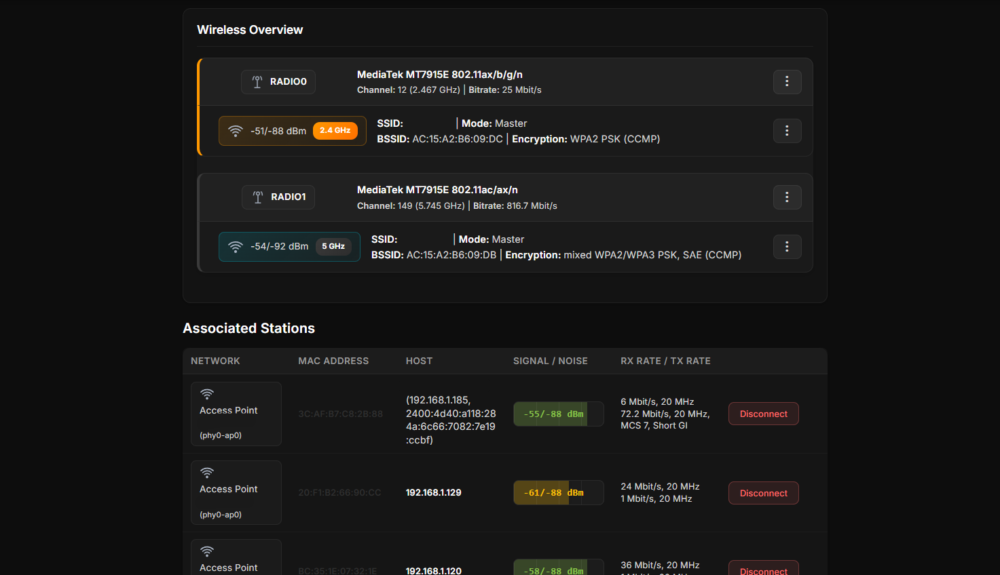
  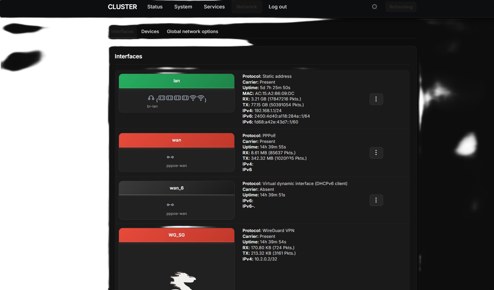
  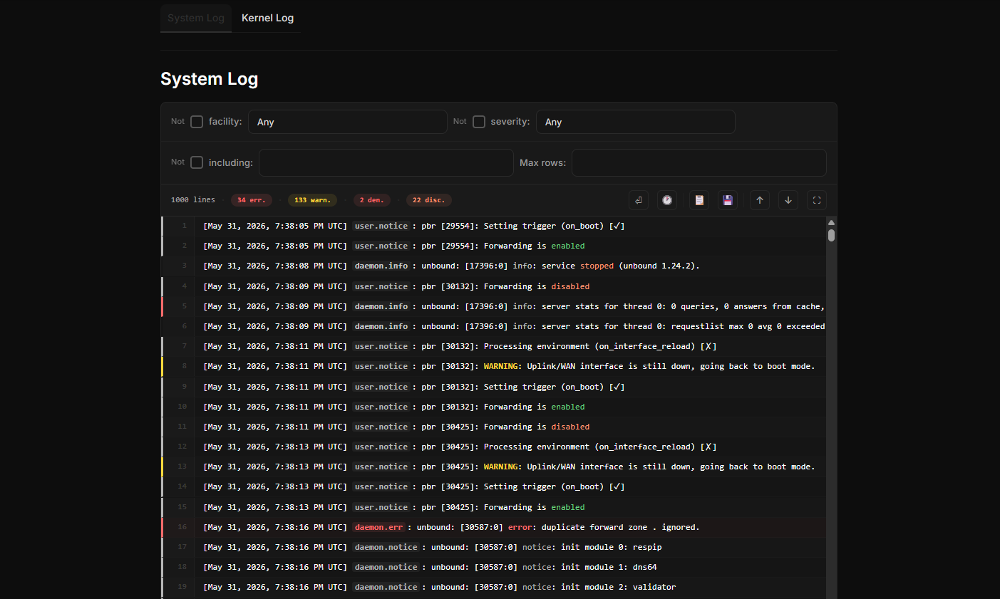
  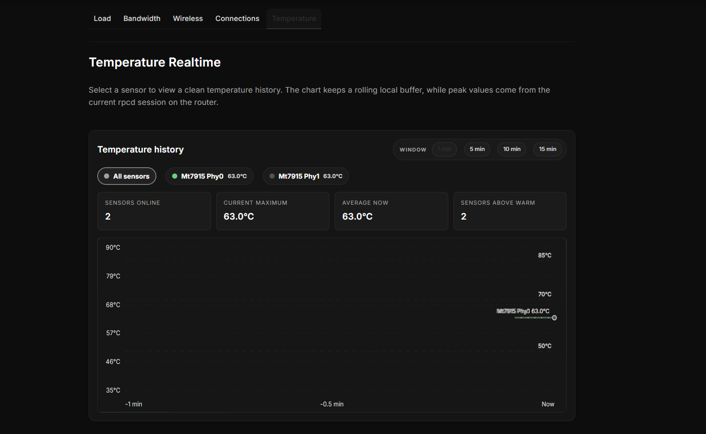
  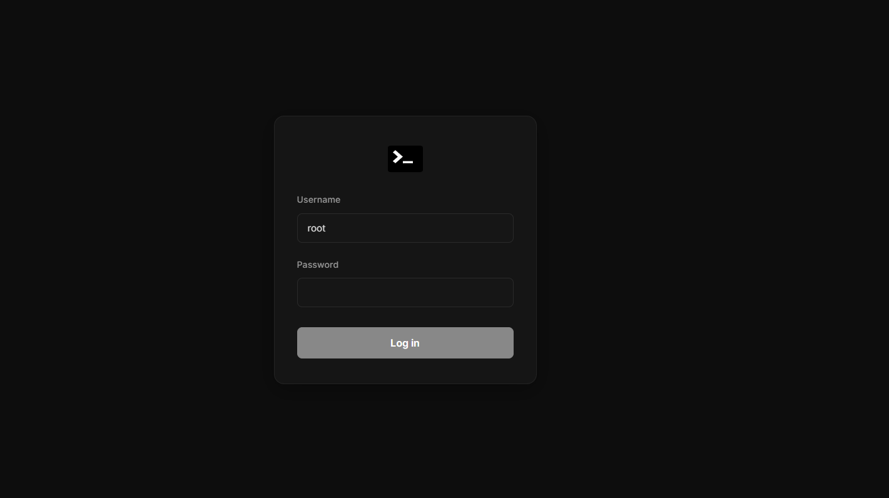
</div>

### Mobile

<div align="center">
  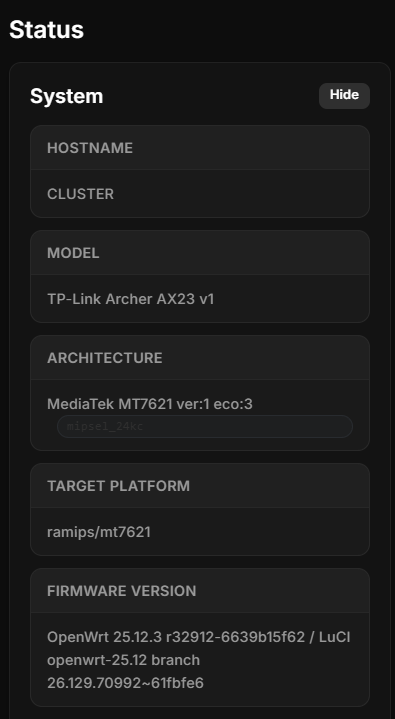
  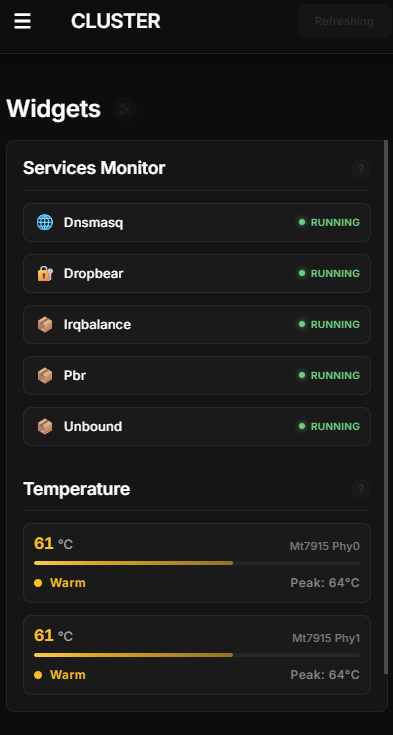
  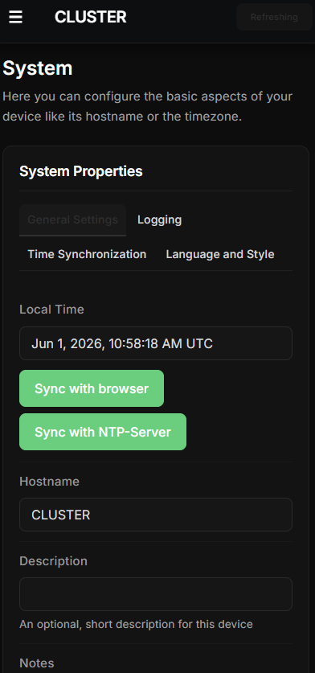
  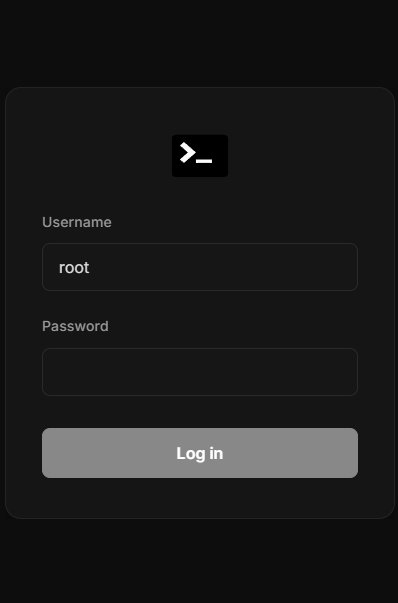
  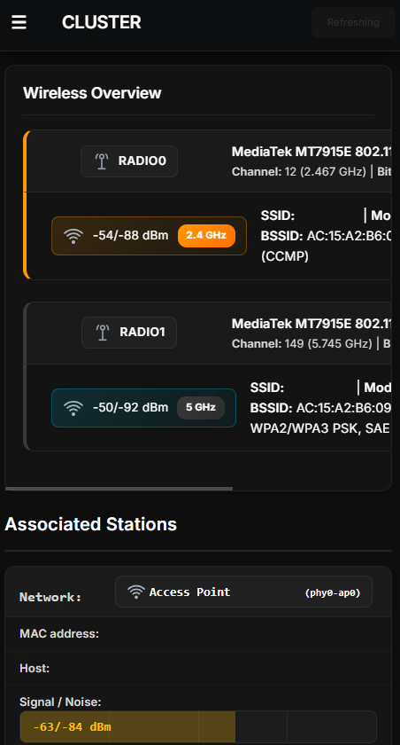
  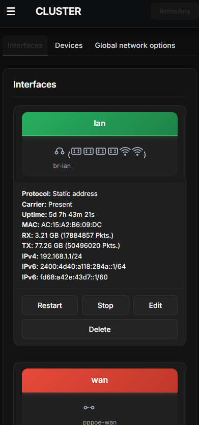
  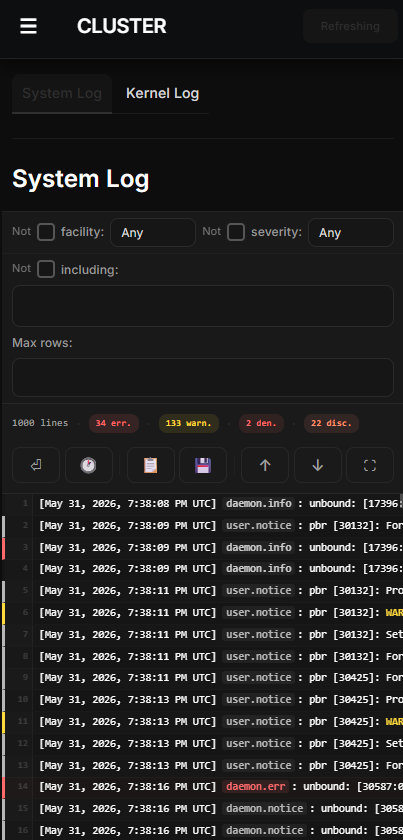
  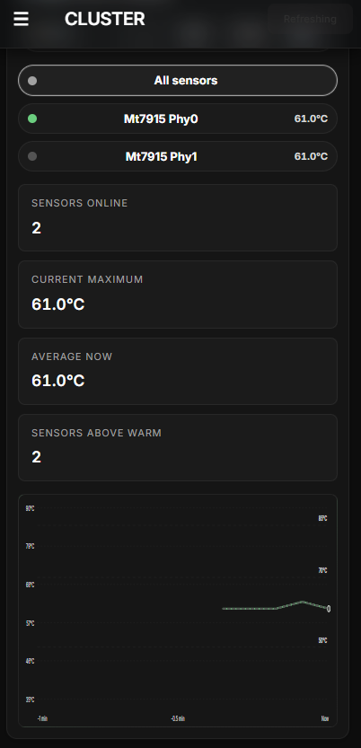
</div>

## Features

- 🌙 Dark glass/blur design with optional light mode
- 🎨 Customizable accent color, border radius, zoom
- 📱 Responsive layout for mobile devices
- ⚡ Compatible with LuCI ucode (OpenWrt 23.x+)
- 📊 Services monitoring widget on Status → Overview page
- 🌡️ Temperature monitoring widget with thermal sensors
- 📈 Elegant Load Average visualization with color-coded progress bars
- 🔎 Built-in semantic search with pre-indexed LuCI pages, transliteration, and typo-tolerant matching
- 🔌 Automatic styling for third-party packages and custom pages
- 🌐 Multi-language support (10 languages: EN, RU, ZH, DE, UK, ES, PT, PL, FR, IT)
- 🔄 Settings sync across browsers/devices (localStorage + UCI)

## Widgets

### Services Widget

The Status → Overview page includes a widget for tracking services:

- Running / stopped state display
- Add services from a model list or custom input
- Saved in the browser for quick setup

### Temperature Widget

Temperature monitoring is available on Status → Overview:

- Reads from `/sys/class/thermal/` and `/sys/class/hwmon/`
- Color-coded temperature levels
- Peak temperature tracking
- Auto refresh every 5 seconds

## Search

The top bar includes built-in LuCI search:

- Semantic search across pages, tabs, and settings
- Keyboard layout swap plus basic RU/LAT transliteration
- Manual page indexing with cached search data stored on the router

## Theme Settings

Open **System → System → Language and Style** to configure:

- Theme mode
- Accent color
- Border radius
- Interface zoom
- Page width
- Animations and transparency
- Custom font (Inter)
- Services widget (enable/disable, grouping, log)
- Temperature widget (enable/disable)
- Log highlighting
- Search page index tools (build and clear cached data)
- Table text wrap (wraps long AP names in Wireless Associated Stations table)

Settings use a hybrid storage model:

- `localStorage` for instant application
- `UCI` in `/etc/config/cluster` for persistence and backups

## Installation

### From a Release Package

Download the latest package on your OpenWrt router and install it.

```bash
wget https://github.com/paradox-x20/luci-theme-cluster/releases/latest/download/luci-theme-cluster_*_all.ipk
opkg install luci-theme-cluster_*_all.ipk
```

For `apk`-based systems:

```bash
wget https://github.com/paradox-x20/luci-theme-cluster/releases/latest/download/luci-theme-cluster-*.apk
apk add --allow-untrusted luci-theme-cluster-*.apk
```

> The `.apk` package must be built by the OpenWrt SDK/buildroot.

### Quick Test Install

Use this only for testing:

```bash
wget -qO- https://raw.githubusercontent.com/paradox-x20/luci-theme-cluster/main/install.sh | sh
```

### Build from Source

```bash
cd ~/openwrt
git clone https://github.com/paradox-x20/luci-theme-cluster package/luci-theme-cluster
./scripts/feeds update -a
./scripts/feeds install -a
make menuconfig
make package/luci-theme-cluster/compile V=s
```

Build outputs are placed in `bin/packages/*/`.

## Removal

```bash
wget -O uninstall.sh https://raw.githubusercontent.com/paradox-x20/luci-theme-cluster/main/uninstall.sh
chmod +x uninstall.sh
./uninstall.sh
```

Or remove it directly:

```bash
opkg remove luci-theme-cluster
apk del luci-theme-cluster
```

To return to the default LuCI theme:

```sh
uci set luci.main.mediaurlbase=/luci-static/bootstrap
uci commit luci
/etc/init.d/uhttpd restart
```

## Project Layout

```
luci-theme-cluster/
├── docs/
│   ├── status.png
│   ├── status-mobile.png
│   └── ...
├── Makefile
├── htdocs/luci-static/
│   ├── cluster/
│   │   ├── cascade.css
│   │   ├── custom-pages.js
│   │   ├── search-cluster-data.js
│   │   ├── search-cluster.js
│   │   ├── services-widget.js
│   │   ├── settings-sync.js
│   │   ├── translations.js
│   │   ├── fonts/
│   │   ├── icons/
│   │   ├── brand.svg
│   │   ├── logo.svg
│   │   └── spinner.svg
│   └── resources/
│       ├── menu-cluster.js
│       └── view/status/cluster-temperature.js
├── root/
│   ├── etc/
│   │   ├── config/cluster
│   │   └── uci-defaults/30_luci-theme-cluster
│   └── usr/share/
│       ├── luci/menu.d/luci-theme-cluster.json
│       └── rpcd/
│           ├── acl.d/luci-theme-cluster.json
│           └── ucode/
│               ├── luci.cluster-search-cache
│               ├── luci.cluster-settings
│               ├── luci.cluster-system
│               └── luci.cluster-temp
└── ucode/template/themes/cluster/
    ├── header.ut
    ├── footer.ut
    └── sysauth.ut
```

## Credits

This project is based on the original work by chestergoodiny:

- [luci-theme-cluster](https://github.com/ChesterGoodiny/luci-theme-proton2025)

Thanks for the base theme and inspiration.

## License

Apache-2.0

Copyright 2025-2026 paradox-x20.

Project icons and bundled SVG assets are original first-party assets covered by Apache-2.0.

See LICENSE and NOTICE for project attribution details.

### Third-Party Assets

- **Inter Font** — Copyright 2020 The Inter Project Authors
  - Licensed under SIL Open Font License 1.1
  - License file: `htdocs/luci-static/cluster/fonts/LICENSE.txt`

## Stargazers

[](https://starchart.cc/paradox-x20/luci-theme-cluster)
